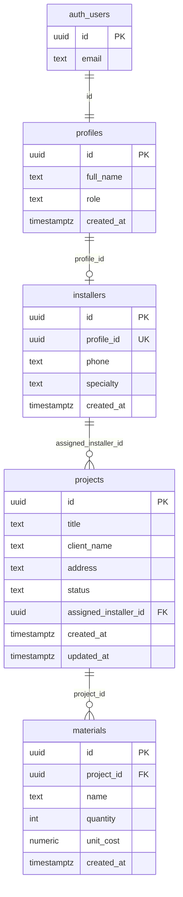

# EcoFlow

Aplicación interna para la gestión de proyectos de instalación de paneles solares.

## 1. Resumen ejecutivo

EcoFlow es un tablero operativo para equipos de energía solar. Permite a administradores crear, asignar y dar seguimiento a instalaciones, y a instaladores consultar y actualizar únicamente los proyectos que les fueron asignados.

La solución está construida con **Spec-Driven Development**: el esquema de datos, las políticas de seguridad y los casos de prueba se especifican primero y el frontend se deriva de esos contratos.

| Capa | Tecnología |
| --- | --- |
| UI | React 18, TypeScript, Vite, Tailwind CSS, Lucide, componentes estilo Shadcn/UI |
| Datos | Supabase (PostgreSQL + Auth + Row Level Security) |
| QA | Vitest, React Testing Library, matriz SQL de RLS |

Roles:

- **admin**: CRUD completo de proyectos y visibilidad global.
- **installer**: lectura y actualización solo de proyectos asignados a su fila en `installers`.

---

## 2. Diagrama entidad-relación



Estados de `projects.status`: `Pendiente`, `En Progreso`, `Completado`.

Roles de `profiles.role`: `admin`, `installer`.

---

## 3. Matriz de seguridad RLS

RLS está habilitado en `profiles`, `installers`, `projects` y `materials`. El rol `anon` no tiene políticas de acceso: toda lectura anónima queda denegada.

Las funciones `is_admin()`, `current_installer_id()` y `can_access_project(uuid)` son `SECURITY DEFINER` con `search_path = public` para resolver el rol sin recursión de políticas.

| Recurso | Actor | SELECT | INSERT | UPDATE | DELETE |
| --- | --- | --- | --- | --- | --- |
| `projects` | admin autenticado | Todos | Sí | Todos | Sí |
| `projects` | installer autenticado | Solo `assigned_installer_id = current_installer_id()` | Denegado | Solo asignados (no puede reasignar) | Denegado |
| `projects` | anónimo | Denegado | Denegado | Denegado | Denegado |
| `materials` | admin / installer | Si hay acceso al proyecto padre | Igual | Igual | Igual |
| `profiles` | autenticado | Propio; admin ve todos | Trigger de Auth | Propio (sin cambiar rol) / admin | No (cascade de Auth) |
| `installers` | autenticado | Propio; admin ve todos | Admin | Propio / admin | Admin |

### Políticas clave de `projects`

1. `projects_admin_all`: `USING (is_admin())` y `WITH CHECK (is_admin())` para `FOR ALL`.
2. `projects_installer_select`: `USING (assigned_installer_id = current_installer_id())`.
3. `projects_installer_update`: mismo predicado en `USING` y `WITH CHECK` para impedir que un instalador se reasigne el proyecto a otra cuadrilla.

### Automatización

- `on_auth_user_created`: al insertar en `auth.users` crea `profiles` y, si el rol es `installer`, la fila correspondiente en `installers`.
- `set_projects_updated_at`: mantiene `projects.updated_at` en cada `UPDATE`.

---

## 4. Matriz completa de casos de prueba (QA)

| ID | Módulo | Descripción | Entradas | Resultado esperado | Estado |
| --- | --- | --- | --- | --- | --- |
| TC-UI-01 | `ProjectFormModal` | Envío con título, cliente y dirección vacíos | Formulario vacío + clic en Crear | No se invoca inserción; se muestran errores de validación | Pasó |
| TC-UI-02 | `ProjectFormModal` | Envío válido con estado e instalador | Título, cliente, dirección, estado `En Progreso`, instalador `inst-1` | `onSubmit` recibe el payload recortado y tipado | Pasó |
| TC-HOOK-01 | `useProjects` | Ciclo de carga | Fetch resuelto con lista vacía | `loading: true` al montar, `false` al terminar | Pasó |
| TC-HOOK-02 | `useProjects` | Fallo de red | `Failed to fetch` | `error.message` estructurado; lista vacía | Pasó |
| TC-HOOK-03 | `useProjects` | Rechazo RLS | Código `42501` + mensaje de policy | Error de aplicación con texto de denegación RLS | Pasó |
| TC-RLS-01 | PostgreSQL / `projects` | Admin lee todos los proyectos | JWT `sub` = admin | ÉXITO: ≥ 2 filas | Manual / SQL |
| TC-RLS-02 | PostgreSQL / `projects` | Instalador A consulta proyectos de B | JWT `sub` = instalador A | 0 filas del instalador B | Manual / SQL |
| TC-RLS-03 | PostgreSQL / `projects` | Instalador A inserta un proyecto | `INSERT` autenticado como A | DENEGADO por política RLS | Manual / SQL |
| TC-RLS-04 | PostgreSQL / `projects` | Anónimo lee `projects` | Rol `anon` | DENEGADO (0 filas) | Manual / SQL |
| TC-AUTH-01 | Login | Credenciales vacías | Email/password vacíos | Mensaje local; no hay sesión | Manual |
| TC-AUTH-02 | Login | Credenciales válidas | Usuario Auth de Supabase | Redirección al tablero | Manual |
| TC-AUTH-03 | Navbar | Indicador de rol | Perfil admin o installer | Badge `admin` o `instalador` | Manual |
| TC-DASH-01 | Dashboard | Filtro por estado | Select `Pendiente` | Solo tarjetas amarillas | Manual |
| TC-DASH-02 | Dashboard | Búsqueda por cliente/título | Texto parcial | Grilla filtrada | Manual |
| TC-DASH-03 | Dashboard | Métricas | N proyectos en cada estado | Contadores Total / Pendientes / En progreso / Completados | Manual |
| TC-DASH-04 | Dashboard | Instalador no crea proyectos | Sesión installer | No se muestra el botón Nuevo proyecto | Manual |
| TC-UX-01 | UI | Estados de carga | Fetch lento | Skeletons en la grilla | Manual |
| TC-UX-02 | UI | Paleta y responsive | Viewport móvil y desktop | Verde esmeralda, forest, slate, acentos azules; layout mobile-first | Manual |

Los casos automatizados de UI y hooks se ejecutan con `npm test`. Los casos RLS se ejecutan con `supabase/tests/rls_test_cases.sql` (transacción con `ROLLBACK`).

---

## 5. Caso de estudio de IA: RLS condicional por rol con JOIN implícito

### Problema

Había que expresar en PostgreSQL: *«un admin ve todos los proyectos; un instalador solo los suyos»*, sin filtrar en el cliente (el cliente no es de confianza) y sin provocar **recursión infinita** al consultar `profiles` desde una política de `projects`.

Un JOIN explícito en la política:

```sql
using (
  exists (
    select 1
    from profiles p
    join installers i on i.profile_id = p.id
    where p.id = auth.uid()
      and p.role = 'admin'
  )
);
```

parece correcto, pero si `profiles` también tiene RLS que consulta `projects` (o vuelve a consultar `profiles`), el planificador puede reentrar en las mismas políticas.

### Cómo se usó la IA

1. **Especificación primero.** Se tradujo el requisito de negocio a predicados `USING` / `WITH CHECK` separados por comando (`SELECT`, `INSERT`, `UPDATE`, `DELETE`) porque en Postgres las políticas del mismo comando se combinan con OR.
2. **Separación de identidad y autorización.** La IA propuso extraer el JOIN a funciones `SECURITY DEFINER`:
   - `is_admin()` lee `profiles.role` como dueño de la función (bypass de RLS en esa lectura puntual).
   - `current_installer_id()` resuelve `installers.id` a partir de `auth.uid()`.
   - `can_access_project(id)` reutiliza ambas para `materials`.
3. **Prevención de escalada.** En `UPDATE` de instalador, el mismo predicado se replica en `WITH CHECK` para que no pueda cambiar `assigned_installer_id` a otro instalador.
4. **Prueba como especificación.** Se generó `rls_test_cases.sql` con cuatro escenarios (admin, aislamiento entre instaladores, INSERT denegado, anónimo) para que el comportamiento quede regresionado fuera del frontend.

### Resultado

El frontend solo consume `supabase.from('projects')`. El aislamiento entre cuadrillas no depende de un `.eq()` en JavaScript: si un instalador altera la petición, RLS sigue devolviendo 0 filas o un error `42501`, que `useProjects` mapea a un mensaje explícito de denegación.

---

## 6. Guía de instalación, tests, entorno y despliegue

### Requisitos

- Node.js 20+
- npm 10+
- Proyecto Supabase (hosted o CLI local)

### 1. Instalar dependencias

```bash
npm install
```

### 2. Variables de entorno

Copie `.env.example` a `.env`:

```bash
VITE_SUPABASE_URL=https://YOUR_PROJECT.supabase.co
VITE_SUPABASE_ANON_KEY=your_anon_key
```

Nunca use la `service_role` key en el frontend.

### 3. Base de datos

En el SQL Editor de Supabase (o `psql`):

```bash
# esquema + RLS + triggers
supabase/schema.sql

# matriz RLS (hace ROLLBACK; no deja datos de prueba)
supabase/tests/rls_test_cases.sql
```

Cree usuarios en Authentication > Users. El trigger `on_auth_user_created` inserta el perfil. Para un administrador, registre el usuario con metadata:

```json
{ "full_name": "Ana Admin", "role": "admin" }
```

o actualice `profiles.role` a `admin` después del alta (con un cliente service role o desde el SQL Editor).

### 4. Desarrollo

```bash
npm run dev
```

Abra `http://localhost:5173`, inicie sesión y use el tablero.

### 5. Tests automatizados

```bash
npm test
```

Modo watch:

```bash
npm run test:watch
```

### 6. Build de producción

```bash
npm run build
npm run preview
```

### 7. Despliegue

1. Aplique `supabase/schema.sql` en el proyecto de producción.
2. Configure `VITE_SUPABASE_URL` y `VITE_SUPABASE_ANON_KEY` en el hosting (Vercel, Netlify o similar).
3. Despliegue el contenido de `dist/` generado por `npm run build`.
4. Restrinja Auth a los correos corporativos (allowlist o dominio) y deshabilite el registro público si la app es solo interna.
5. Reejecute `rls_test_cases.sql` contra un entorno de staging antes de promover.

### Estructura del frontend

```
src/
  lib/supabaseClient.ts
  types/database.types.ts
  hooks/useAuth.ts
  hooks/useProjects.ts
  components/ui/
  components/layout/Navbar.tsx
  components/dashboard/ProjectCard.tsx
  components/dashboard/ProjectFormModal.tsx
  components/dashboard/ProjectMetrics.tsx
  pages/LoginPage.tsx
  pages/DashboardPage.tsx
```

### Paleta UI

| Token | Hex | Uso |
| --- | --- | --- |
| Esmeralda | `#10B981` | Acciones primarias, marca |
| Verde oscuro | `#065F46` | Hover / texto de éxito |
| Slate | `#0F172A` | Texto principal |
| Azul | `#3B82F6` | Estado En Progreso |
| Ámbar / verde | badges | Pendiente / Completado |

Interacciones: `transition-all duration-200`, skeletons de carga y `Alert` para red y RLS.

## Demo / Video de demostración

Puedes ver el video de demostración del sistema aquí:

[Ver Video de Demostración](video/Grabación%202026-10-06%20143422.mp4)